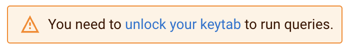

# Getting Started 

Attendees should familarize themselves with the content below and take the required actions:

1. Login to CDP Public Cloud
2. Set Workload Password
3. Navigate and open all required UIs
4. Unlock Keytab in Sql Stream Builder

## Warnings
 * Use a Personal Laptop
 * Disable VPNs
 * Try Icognito Browser (Chrome & Safari Preferred)
 * Do not copy/paste strings w/ trailing characters.  Use GitHub Copy Buttons.

***

## Copy Paste Board

You will be frequently copy/pasting the following details.  To make sure you get the correct values, use the COPY button top right.

### Workload Password

```
#P7dFpyAe@Gttd#
```

### Kafka Brokers
```
csp-hol-kafka-corebroker0.se-sandb.a465-9q4k.cloudera.site:9093,csp-hol-kafka-corebroker1.se-sandb.a465-9q4k.cloudera.site:9093,csp-hol-kafka-corebroker2.se-sandb.a465-9q4k.cloudera.site:9093
```
### Schema Registry URL
```
https://csp-hol-kafka-master0.se-sandb.a465-9q4k.cloudera.site:7790/api/v1
```

### Kudu Masters
```
csp-hol-kudu-master10.se-sandb.a465-9q4k.cloudera.site:7051,csp-hol-kudu-master20.se-sandb.a465-9q4k.cloudera.site:7051,csp-hol-kudu-master30.se-sandb.a465-9q4k.cloudera.site:7051
```

***

## How to Login to Cloudera Public Cloud

[Link To Login](#)

After login you should see CDP Public Cloud Home Screen


From any CDP Public Cloud page you can click this icon  (top left) to open the full Left Navigation

  

## Workload Password Setup

From Home Screen click your Username (bottom left) and navigate to your Profile to click Set Workload Password:


## How to find Data Hub UIs (Hue, Schema Registry, Streams Messaging Manager, Sql Stream Builder)

From Home Screen click on Data Hub Clusters and search "csp-hol"


Click into the csp-hol-kudu Data Hub and open Hue:


Click into csp-hol-kafka Data Hub and open Schema Registry and Streams Messaging Manager UIs:


Click into csp-hol-flink Data Hub and open Streaming SQL Console:


Once you open the UI, click the    to open your UserId's Default Project.


## How to Unlock Keytab in SSB

When you first open your default project, you will be presented with the following prompt:



Click into provide your username and workload password as follows:


Click Unlock Keytab:


***

## References

Check out Whats New in [CDP 7.1.9](https://docs.cloudera.com/cdp-private-cloud-base/7.1.9/runtime-release-notes/topics/rt-pvc-whats-new.html) 

Check out Whats new in [CSA 1.11](https://docs.cloudera.com/csa/1.11.0/release-notes/topics/csa-what-new.html)

Check SQL Stream Builder in [CDP Public Cloud SSB](https://docs.cloudera.com/csa/1.11.0/ssb-overview/topics/csa-ssb-key-features.html)

Check out CSA Docs [Cloudera Streaming Analytics DOCS](https://docs.cloudera.com/csa/1.11.0/index.html)

 * [SSB](https://docs.cloudera.com/csa/1.11.0/ssb-overview/topics/csa-ssb-intro.html) 
 * [CSA](https://docs.cloudera.com/csa/1.11.0/index.html) 
 * [HUE]()
 * [Apache Nifi](https://nifi.apache.org)
 * [Apache Kafka](https://kafka.apache.org)
 * [Apache Flink](https://flink.apache.org/) 
 * [Apache Iceberg](https://iceberg.apache.org/)
 * [Apache Kudu](https://kudu.apache.org/)
